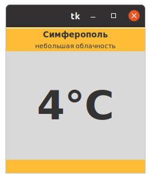
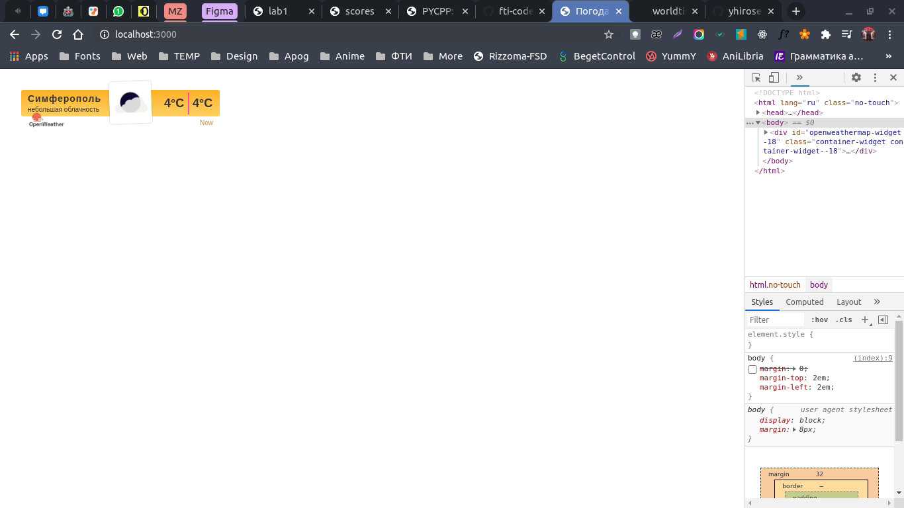

МИНИСТЕРСТВО НАУКИ  И ВЫСШЕГО ОБРАЗОВАНИЯ РОССИЙСКОЙ ФЕДЕРАЦИИ 
Федеральное государственное автономное образовательное учреждение высшего образования 
"КРЫМСКИЙ ФЕДЕРАЛЬНЫЙ УНИВЕРСИТЕТ им. В. И. ВЕРНАДСКОГО" 
ФИЗИКО-ТЕХНИЧЕСКИЙ ИНСТИТУТ 
Кафедра компьютерной инженерии и моделирования

 
<h3 align="center">Отчёт по лабораторной работе № {2}  по дисциплине "Программирование"</h3>
  

студента 1 курса группы ПИ-б-о-201(2) 
Никонова Федора Андреевича 
направления подготовки 09.03.01 "Программная инженерия"

  
<table>
<tr><td>Научный руководитель  старший преподаватель кафедры  компьютерной инженерии и моделирования</td>
<td>(оценка)</td>
<td>Чабанов В.В.</td>
</tr>
</table>
  

Симферополь, 2020

## Постановка задачи

1. Разработайте и зарегистрируйте навык для Алисы на сервисе Яндекс.Диалоги;

2. В качестве backend-a для навыка реализуйте приложение на языке С++ выполняющее следующие функции:
   1. Составление продуктовой корзины:
      * Добавление продукта в корзину;
      * Удаление продукта из корзины;
      * Очистка корзины;
      * Вывод списка товаров в корзине;
      * Подсчёт стоимости товаров в корзине.
   2. Вывод справочной информации по навыку;
   3. Регистрацию webhook-ов сторонних сервисов;
   4. Отправку данных на сторонние сервисы. 

3. В качестве стороннего сервиса реализуйте приложение на языке Python выполняющее следующие функции:
   1. Ожидание данных о покупке;
   2. Сохранение поступивших данных в excel-документ.

## Цель работы
Целью работы является научится создавать навык для Алисы на сервисе Яндекс.Диалоги и сохранять данные в файлах Excel.

Директории:
[[C++]](./C++) [[Python]](./Python)

## Выполнение работы

Разработка проекта началась с регистрации навыка для Алисы. Название навыка выбрано `feora cart`, поскольку у меня были наработки для этого имени и был логотип.

<u onclick="this.nextElementSibling.style.display=this.nextElementSibling.style.display?'':'none'">Показать изображение</u>

   

    
   Рис. 1. Первая картинка

Начальным этапом стала адаптация проекта лабораторной работы №1 под нужды этой работы. Важным аспектом явилась настойка компиляции и линковки исходного кода, что позволило значительно сократить время компиляции, тем самым ускорив процесс разработки.

На ранних этапах проект уже обладал функциями по работе с файловой системой и обработкой роутинга. был произведен рефакторинг с применением парадигмы ООП, что позволило повысить читабельность кода несмотря на синтаксические особенности языка С++.
Сперва было выполнено ознакомление с api openweathermap и worldtimeapi. На практике были выведены требуемые запросы.

Далее был разработан сервер. Разработка происходила в два этапа, согласно заданным роутам:

1. Разработка обработчика на роут "/"
2. Разработка обработчика на роут "/raw"

Оба роута имеют повторяющийся код, который был выделен в отдельные файлы, благодаря чему была достигнута высокая читабельность программного кода.

Выделенные код был разбит на файлы и помещён в папку `tools`. Сами роуты находятся в папке `routes`. Каждый файл имеет защиту от повторного подключения, что позволяет избежать ошибок и оптимизировать процесс сборки и выполнения программы.

Все файлы подключаются в `01.cpp`, который является входной точкой в проект и содержит функцию *main*.

Во время работы сервера в консоль выводится отладочная информация, позволяющая отследить работу сервера и отловить возникающие ошибки.

### Информация о проекте

Используется последний **стандарт языка** С++ на текущий момент (20.11.2020): `С++17`

**Сборщик**: `gcc v10.2.0` на операционной системе `Ubuntu 20.04.01 LTS`

### Обязательная информация

6. Скриншот клиентского приложения:

    
   Рис. 2. Виджет клиента

7. Скриншот браузерного виджета:

    
   Рис. 3. Виджет в браузере

Директории:
[[C++]](./C++) [[Python]](./Python)
## Вывод
Все поставленные задачи выполнены, а цель работы достигнута - разработано многомодульное клиент-серверное приложение, позволяющее узнать погоду на текущий момент времени. 

В разработке сервера использованы две сторонние библиотеки: json и cpp-httplib. Клиент использует библиотеку TKinter для отрисовки пользовательского интерфейса.

Практика показывает, что любое приложение рано или поздно требует хранения информации на серверах, поэтому умение разрабатывать клиент-серверные приложения является важным навыком в современном мире программирования.