<p align="center">МИНИСТЕРСТВО НАУКИ  И ВЫСШЕГО ОБРАЗОВАНИЯ РОССИЙСКОЙ ФЕДЕРАЦИИ<br>
Федеральное государственное автономное образовательное учреждение высшего образования<br>
"КРЫМСКИЙ ФЕДЕРАЛЬНЫЙ УНИВЕРСИТЕТ им. В. И. ВЕРНАДСКОГО"<br>
ФИЗИКО-ТЕХНИЧЕСКИЙ ИНСТИТУТ<br>
Кафедра компьютерной инженерии и моделирования</p>
<br>
<h3 align="center">Отчёт по лабораторной работе № 2<br> по дисциплине "Программирование"</h3>
<br><br>
<p>студента 1 курса группы ПИ-б-о-201(2)<br>
Никонова Федора Андреевича<br>
направления подготовки 09.03.01 "Программная инженерия"</p>
<br><br>
<table>
<tr><td>Научный руководитель<br> старший преподаватель кафедры<br> компьютерной инженерии и моделирования</td>
<td>(оценка)</td>
<td>Чабанов В.В.</td>
</tr>
</table>
<br><br>
<p align="center">Симферополь, 2020</p>
<hr>

## Постановка задачи

1. Разработайте и зарегистрируйте навык для Алисы на сервисе Яндекс.Диалоги;

2. В качестве backend-a для навыка реализуйте приложение на языке С++ выполняющее следующие функции:
   1. Составление продуктовой корзины:
      * Добавление продукта в корзину;
      * Удаление продукта из корзины;
      * Очистка корзины;
      * Вывод списка товаров в корзине;
      * Подсчёт стоимости товаров в корзине.
   2. Вывод справочной информации по навыку;
   3. Регистрацию webhook-ов сторонних сервисов;
   4. Отправку данных на сторонние сервисы. 

3. В качестве стороннего сервиса реализуйте приложение на языке Python выполняющее следующие функции:
   1. Ожидание данных о покупке;
   2. Сохранение поступивших данных в excel-документ.

## Цель работы
Целью работы является научится создавать навык для Алисы на сервисе Яндекс.Диалоги и сохранять данные в файлах Excel.

Директории:
[[C++]](./C++) [[Python]](./Python)

### Информация о проекте

Стандарт С++: `С++20`
<br>
Компилятор: `g++-10` (gcc v10.2.0)
<br>
ОС: `Ubuntu 20.04.01 LTS`

## Выполнение работы

Разработка проекта началась с регистрации навыка для Алисы. Название навыка выбрано `feora cart`, поскольку у меня были наработки для этого имени и был логотип.

<p align="center">
<br>
Рис. 1. Логотип для навыка
</p>

Следующим этапом стала адаптация проекта лабораторной работы №1 под нужды этой работы. Важным аспектом явилась настойка компиляции и линковки исходного кода, что позволило значительно сократить время компиляции, тем самым ускорив процесс разработки.

На ранних этапах проект уже обладал функциями по работе с файловой системой и обработкой роутинга. был произведен рефакторинг с применением парадигмы ООП, что позволило повысить читабельность кода несмотря на синтаксические особенности языка С++.

Были установлены два слушателя пост запросов на роуты:
1. "/"
2. "/webhooks"

Логика этих слушателей находится в папке [routes](./C++/include/routes).

### Роут webhooks

Далее была запрограммирована логика обработки `/webhooks`. Она была вынесена в отдельный класс [HooksPage](./C++/include/HooksPage). Этот класс имеет методы настройки хуков и генерации html кода страницы. При инициализации он получает шаблоны html кода из папки [html](./C++/html).
<details><summary>Исходный код</summary>
<details><summary>Заголовочный файл</summary>

```c++
#pragma once

#include <iostream>
#include <string>
#include <vector>
#include <File/File.h>
#include <tools/replaceAll.h>
#include <json/json.hpp>
using json = nlohmann::json;

class HooksPage {
public:
   struct {
      std::string page;
      std::string single;
   } templates;

   File* configFile;
   json config;

   HooksPage(std::string pageTemplatePath, std::string singleTemplatePath);
   HooksPage();

   bool updateConfigFile();

   int getHookIndex(std::string url);
   void setHook(std::string url);
   void delHook(std::string url);

   std::string getHtml();
};
```
</details>
<details><summary>Реализация</summary>

```c++
#include "HooksPage.h"

HooksPage::HooksPage() {
   std::cout << "creating HooksPage Free";
   auto pwd = File::pwd();
   std::cout << pwd;
}

HooksPage::HooksPage(std::string pageTemplatePath, std::string singleTemplatePath) {
   auto pwd = File::pwd();
   auto page = new File(pwd + "/../html" + pageTemplatePath);
   auto single = new File(pwd + "/../html" + singleTemplatePath);
   templates.page = page->read();
   templates.single = single->read();

   configFile = new File(pwd + "/../json/config.json");
   bool exists = configFile->exists();
   if (!exists) {
      configFile->write(R"({ "webhooks": [] })");
   }
   config = configFile->readJson();
}

bool HooksPage::updateConfigFile() {
   return configFile->writeJson(config);
}

int HooksPage::getHookIndex(std::string url) {
   int i = 0;
   for (auto& hook : config["webhooks"]) {
      if (url == hook.get<std::string>()) return i;
      i++;
   }
   return -1;
}
void HooksPage::setHook(std::string url) {
   if (getHookIndex(url) == -1) {
      config["webhooks"].push_back(url);
      updateConfigFile();
   }
}
void HooksPage::delHook(std::string url) {
   int index = getHookIndex(url);
   if (index != -1) {
      config["webhooks"].erase(index);
      updateConfigFile();
   }
}

std::string HooksPage::getHtml() {
   std::string webhooksHtml = "";
   for (auto& hook : config["webhooks"]) {
      webhooksHtml += replaceAll(templates.single, "{Webhook URL}", hook) + "
";
   }
   std::string resHtml = replaceAll(templates.page, "{webhooks_list}", webhooksHtml);
   return resHtml;
}
```
</details>
</details>
<br>

Код роута [rotes/webhooks](./C++/include/rotes/webhooks) использует этот класс и представляет следующую реализацию:
<details><summary>Исходный код</summary>
<details><summary>Заголовочный файл</summary>

```c++
#pragma once

#include <HooksPage/HooksPage.h>

#include <json/json.hpp>
using json = nlohmann::json;
#include <cpp_httplib/httplib.h>
using namespace httplib;

extern HooksPage webhooksPage;

namespace RouteWebhooks {

   void Handler(const Request& req, Response& res);

} // namespace RouteWebhooks

```
</details>
<details><summary>Реализация</summary>

```c++
#include "webhooks.h"

namespace RouteWebhooks {

   void Handler(const Request& req, Response& res)
   {
      if (req.has_param("del")) {
         auto val = req.get_param_value("del");
         webhooksPage.delHook(val);
      }
      else if (req.has_param("set")) {
         auto val = req.get_param_value("set");
         webhooksPage.setHook(val);
      }

      std::cout << "Req: " << req.body.c_str() << std::endl;
      res.set_content(webhooksPage.getHtml(), "text/html; charset=UTF-8");
   }

} // namespace RouteWebhooks
```
</details>
</details>
<br>

Логика отвечающая за изменение файла [json/config.json](./C++/json/config.json) также содержится в классе [HooksPage](./C++/include/HooksPage), поэтому об этом думать не приходится.

<p align="center">
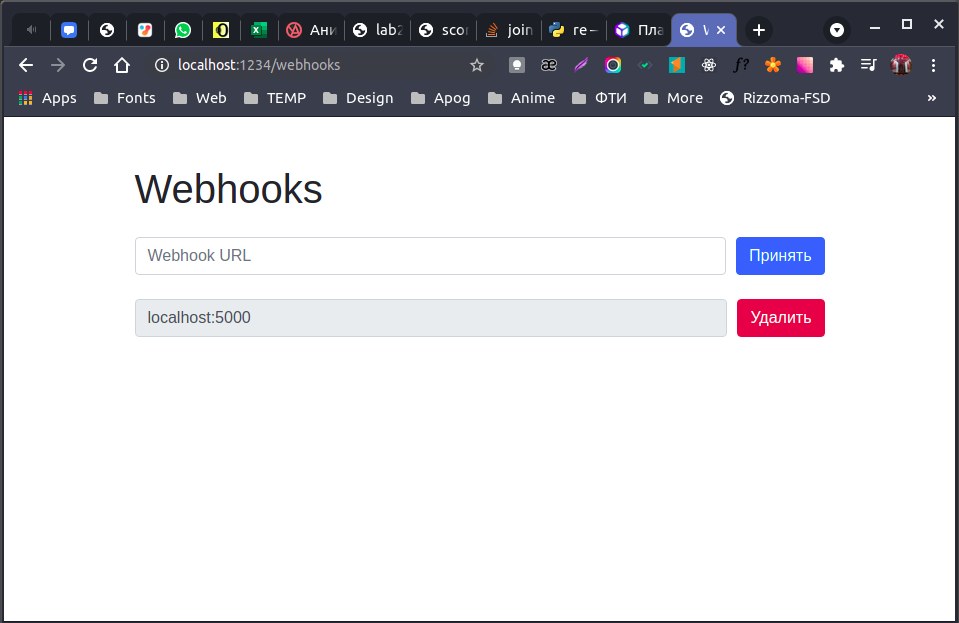<br>
Рис. 2. Страница регистрации вебхуков
</p>

### Роут root

Основная часть программной логики содержится в роуте [rotes/root](./C++/include/rotes/root). Этот роут отвечает за общение с сервисом Yandex.Dialogs. Главной функцией в этом файле является dialog. Она отвечает за генерацию ответа в формате JSON на основе файлов из папки [json](./C++/json).

Остальная часть является большой if-elseif-else конструкцией, которая определяет, когда и какой диалог генерировать.

Также этот роут отвечает за отправление чека пользователя при окончании сессии.

<details><summary>Исходный код</summary>
<details><summary>Заголовочный файл</summary>

```c++
#pragma once

#include <json/json.hpp>
using json = nlohmann::json;
#include <cpp_httplib/httplib.h>
using namespace httplib;

#include <tools/replaceAll.h>
#include <HooksPage/HooksPage.h>

extern HooksPage webhooksPage;

namespace RouteRoot {

   const std::string DIALOGS_JSON_PATH = File::pwd() + "/../json/dialog";

   std::string dialog(std::string dialogName, json state, json config = R"({})"_json);

   void Handler(const Request& req, Response& res);

   std::string getCommand(json yandexJson);

   std::string getProductName(json yandexJson, int productTokenIndex);
   json getProductSet(json yandexJson, int productTokenIndex);
   void removeProduct(int productTokenIndex, json& yandexJson, json& state);

   std::string rubleString(int number);
} // namespace RouteRoot
```
</details>
<details><summary>Реализация</summary>

```c++
#include "root.h"

namespace RouteRoot {

   std::string dialog(std::string dialogName, json state, json config) {
      std::string targetJsonString = File::Read(DIALOGS_JSON_PATH + "/" + dialogName);
      json targetDialog = json::parse(targetJsonString);
      bool notStartup = state != nullptr;

      std::cout << "Taking dialog: " << dialogName << std::endl;

      if (notStartup) { // not startup
         if (config.contains("buttons")) { // generate buttons
            auto buttons = config["buttons"].get<std::string>();

            if (buttons == "speak") { // speak buttons
               if (!state["speak"].get<bool>()) {
                  //targetDialog["parameters"] = R"({
                  //   "instance": "mute"
                  //})"_json;
                  //targetDialog["response"]["tts"] = nullptr;
                  targetDialog["response"].erase("tts");
                  targetDialog["response"]["buttons"].push_back(R"({ "title": "Говорить" })"_json);
               }
               else {
                  targetDialog["response"]["buttons"].push_back(R"({ "title": "Молчать" })"_json);
               }
               targetDialog["response"]["buttons"].push_back(R"({ "title": "Корзина" })"_json);
            } // speak buttons
            else if (buttons == "cart") { // cart buttons
               json buttonsCart = R"([
               { "title": "Очистить корзину" },
               { "title": "Добавить в корзину" },
               { "title": "Удалить из корзины" },
               { "title": "Что в корзине" },
               { "title": "Сумма" },
               { "title": "Покупка завершена" }
            ])"_json;

               for (auto& button : buttonsCart) {
                  targetDialog["response"]["buttons"].push_back(button);
               }
            } // cart buttons
         } // generate buttons

         if (config.contains("help_all_name")) { // single help
            std::string helpText, helpTts;
            auto helpName = config["help_all_name"].get<std::string>();

            auto helpArr = json::parse(targetDialog["help_arr"].dump());
            targetDialog.erase("help_arr");

            for (auto it = helpArr.begin(); it != helpArr.end(); ++it) {
               json helpCurr = *it;
               auto helpNameCurr = helpCurr["name"].get<std::string>();
               if (helpNameCurr == helpName) {
                  helpText = helpCurr["text"].get<std::string>();
                  helpTts = helpCurr["tts"].get<std::string>();
                  break;
               }
            }

            std::cout << "help.text: " << helpText << std::endl;
            std::cout << "help.tts: " << helpTts << std::endl;
            targetDialog["response"]["text"] = helpText;
            targetDialog["response"]["tts"] = helpTts;
         } // single help

         if (config.contains("text")) { // use custom text
            auto newText = config["text"].get<std::string>();
            targetDialog["response"]["text"] = newText;
            targetDialog["response"]["tts"] = newText;
         } // use custom text

         targetDialog["session_state"] = state;
      } // not startup
      else { // is startup
         state = R"({
            "speak": true,
            "cart": [],
            "mode": "normal"
         })"_json;

         targetDialog["response"]["buttons"].push_back(R"({ "title": "Молчать" })"_json);
         targetDialog["session_state"] = state;
      } // is startup

      return targetDialog.dump();
   }

   void Handler(const Request& req, Response& res)
   {
      std::cout << "------------------------" << std::endl;

      std::string response;
      auto yandexJson = json::parse(req.body);

      // if new session
      if (yandexJson["session"]["new"].get<bool>()) {
         response = dialog("startup.json", nullptr);
      }
      else { // session continue
         auto state = yandexJson["state"]["session"];

         std::string command = getCommand(yandexJson);
         std::cout << "
Команда: " << command << std::endl;
         std::string commandOrig = yandexJson["request"]["original_utterance"].get<std::string>();
         std::cout << "Команда (ориг): " << commandOrig << "
" << std::endl;

         if (!(state.contains("cart") && state.contains("speak") && state.contains("mode"))) {
            response = dialog("error.json", state);
         }
         else { // is correct session data
            auto cart = state["cart"];
            auto speak = state["speak"];
            auto mode = state["mode"];

            bool isWait = state.contains("wait") && !state["wait"].is_null();
            std::string wait = isWait ? state["wait"].get<std::string>() : "";

            auto buttonsNormal = R"({ 
               "buttons": "speak"
            })"_json;
            auto buttonsCart = R"({ 
               "buttons": "cart"
            })"_json;

            int tokensCount = yandexJson["request"]["nlu"]["tokens"].size();

            if (mode == "normal") { // mode: normal
               if (false) {
               }
               else if (command == "молчать") {
                  state["speak"] = false;
                  response = dialog("mode/silent.json", state, buttonsNormal);
               }
               else if (command == "говорить") {
                  state["speak"] = true;
                  response = dialog("mode/speak.json", state, buttonsNormal);
               }
               else if (command == "помощь") {
                  state["mode"] = "help";
                  response = dialog("help/start.json", state);
               }
               else if (command == "корзина") {
                  state["mode"] = "cart";
                  response = dialog("cart/start.json", state, buttonsCart);
               }
               else {
                  response = dialog("unknown.json", state, buttonsNormal);
               }
            } // mode: normal


            else if (mode == "help") { // mode: help
               if (command == "назад") {
                  state["mode"] = "normal";
                  response = dialog("help/end.json", state, buttonsNormal);
               }
               else {
                  response = dialog("help/all.json", state, json::parse("{ \"help_all_name\": \"" + commandOrig + "\" }"));
               }
            } // mode: help


            else if (mode == "cart") { // mode: cart
               if (false) {
               }

               else if (command == "очистить корзину") {
                  state["cart"] = json::array();
                  response = dialog("cart/skill/clean.json", state, buttonsCart);
               }

               else if ((isWait && wait == "добавить в корзину") || command.rfind("добавить в корзину", 0) == 0) { // command starts with ...
                  if (!isWait) { // nothing to wait
                     if (tokensCount == 3) { // no args given
                        state["wait"] = "добавить в корзину";
                        response = dialog("cart/skill/add_no_args.json", state);
                     } // no args given
                     else { // args given
                        json productData = getProductSet(yandexJson, 3);
                        state["cart"].push_back(productData);
                        response = dialog("cart/skill/add.json", state, buttonsCart);
                     } // args given
                  } // nothin to wait
                  else { // was waiting
                     state["wait"] = nullptr;

                     json productData = getProductSet(yandexJson, 0);
                     state["cart"].push_back(productData);
                     response = dialog("cart/skill/add.json", state, buttonsCart);
                  } // was waiting
               }

               else if ((isWait && wait == "удалить из корзины") || command.rfind("удалить из корзины", 0) == 0) {
                  if (!isWait) { // nothing to wait
                     if (tokensCount == 3) { // no args given
                        state["wait"] = "удалить из корзины";
                        response = dialog("cart/skill/remove_no_args.json", state);
                     } // no args given
                     else { // args given
                        removeProduct(3, yandexJson, state);
                        response = dialog("cart/skill/remove.json", state, buttonsCart);
                     } // args given
                  } // nothin to wait
                  else { // was waiting
                     state["wait"] = nullptr;
                     removeProduct(0, yandexJson, state);
                     response = dialog("cart/skill/remove.json", state, buttonsCart);
                  } // was waiting
               }

               else if (command == "что в корзине") {
                  auto cart = state["cart"];

                  if (cart.empty()) response = dialog("cart/skill/list_free.json", state, buttonsCart);
                  else {
                     std::string cartText = "Ща по фактам раскидаю: ";
                     for (auto& product : cart) {
                        auto name = product["name"].get<std::string>();
                        int priceVal = product["price"].get<int>();
                        auto price = std::to_string(priceVal);
                        cartText += name + " на " + price + " " + rubleString(priceVal) + ", ";
                     }
                     json configList = {
                        { "text", cartText },
                        { "buttons", "cart" },
                     };
                     response = dialog("cart/skill/list.json", state, configList);
                  }
               }

               else if (command == "сумма") {
                  int cartSum = 0;
                  for (auto& product : state["cart"]) {
                     cartSum += product["price"].get<int>();
                  }

                  json configSum = {
                        { "text", "Товаров на " + std::to_string(cartSum) + " " + rubleString(cartSum) },
                        { "buttons", "cart" },
                  };
                  response = dialog("cart/skill/sum.json", state, configSum);
               }

               else if (command == "покупка завершена") {
                  std::string id = yandexJson["session"]["user"].contains("user_id")
                     ? yandexJson["session"]["user"]["user_id"].get<std::string>()
                     : "anonymous";
                  json check = {
                     {"user_id", id},
                     {"check", state["cart"]},
                  };

                  std::string checkString = check.dump();
                  std::cout << "Check data:" << checkString << std::endl;

                  for (auto& hook : webhooksPage.config["webhooks"]) {
                     std::string hookString = hook.get<std::string>();
                     std::cout << "Check send: " << hookString << std::endl;
                     Client sender{ hookString.c_str() };

                     sender.Post("/", checkString, "application/json; charset=utf8");
                  }

                  state["mode"] = "normal";
                  response = dialog("cart/end.json", state, buttonsNormal);
               }

               else {
                  response = dialog("unknown.json", state, buttonsCart);
               }
            } // mode: cart
         } // is correct session data
      } // session continue

      std::cout << req.body.c_str() << std::endl;
      res.set_content(response, "text/json; charset=UTF-8");
   }

   std::string getCommand(json yandexJson) { // take command from command prop or nlu list
      std::string command;
      if (yandexJson["request"].contains("command")) {
         command = yandexJson["request"]["command"].get<std::string>();
      }
      else {
         command = "";
         for (auto& token : yandexJson["request"]["nlu"]) {
            command += token.get<std::string>();
         }
      }
      return command;
   }

   std::string getProductName(json yandexJson, int productTokenIndex) {
      return yandexJson["request"]["nlu"]["tokens"][productTokenIndex].get<std::string>();
   }

   json getProductSet(json yandexJson, int productTokenIndex) {
      std::string productName = getProductName(yandexJson, productTokenIndex);

      json entities = yandexJson["request"]["nlu"]["entities"];
      int productPrice;
      for (auto it = entities.begin(); it != entities.end(); ++it) {
         if ((*it)["type"] == "YANDEX.NUMBER") {
            productPrice = (*it)["value"].get<int>();
            break;
         }
      }

      std::cout << "product.name: " << productName << std::endl;
      std::cout << "product.price: " << productPrice << std::endl;

      auto res = json{
         {"name", productName},
         {"price", productPrice},
      };
      return res;
   }

   void removeProduct(int productTokenIndex, json& yandexJson, json& state) {
      json newCart = json::array();

      std::string productName = getProductName(yandexJson, productTokenIndex);
      int i = 0;
      for (auto& product : state["cart"]) {
         std::string productNameCurr = product["name"].get<std::string>();
         if (productName != productNameCurr) {
            newCart.push_back(product);
         }
         i++;
      }

      state["cart"] = newCart;
   }

   std::string rubleString(int number) {
      switch (number % 100)
      {
      case 11:
      case 12:
      case 13:
      case 14:
      case 15:
      case 16:
      case 17:
      case 18:
      case 19: return "рублей"; break;
      default:
         switch (number % 10)
         {
         case 0: return "рублей"; break;
         case 1: return "рубль"; break;
         case 2:
         case 3:
         case 4: return "рубля"; break;
         case 5:
         case 6:
         case 7:
         case 8:
         case 9: return "рублей"; break;
         default: std::cout << "Ошибка rubleString, введите положительное число!"; break;
         }
      }
      return "Ошибка";
   }

} // namespace RouteRoot
```
</details>
</details>
<br>

### File API

Ранее упоминалось взаимодействие с файловой системой, точнее чтение и запись в файлы. Программа работает с JSON файлами из папки [json/dialogs](./C++/json/dialogs), а также с файлом [config.json](./C++/json/config.json). Все эти взаимодействия осуществляются с помощью разработанного класса [File](./C++/include/File). Этот класс обладает рядом статических и нестатических методов, позволяющих читать и записывать как обычный текст, так и сразу JSON.

<details><summary>Исходный код</summary>
<details><summary>Заголовочный файл</summary>

```c++
#pragma once

#include <iostream>
#include <string>
#include <fstream>
#include <sstream>

#include <json/json.hpp>
using json = nlohmann::json;

// File::pwd Linux
#include <libgen.h>         // dirname
#include <unistd.h>         // readlink
#include <linux/limits.h>   // PATH_MAX

class File {
public:
   std::string abspath;

   static std::string pwd();

   static std::string Read(std::string path);
   static void Write(std::string path, std::string data);
   static json ReadJson(std::string path);
   static void WriteJson(std::string path, json data);

   File(std::string abspathToFile);

   std::string read();
   void write(const std::string& data);
   json readJson();
   void writeJson(json data);

   bool exists();
};
```
</details>
<details><summary>Реализация</summary>

```c++
#include "File.h"

// static

std::string File::pwd() {
   char result[PATH_MAX];
   ssize_t count = readlink("/proc/self/exe", result, PATH_MAX);
   const char* path;
   if (count != -1) {
      path = dirname(result);
   }
   return std::string(path);
}

std::string File::Read(std::string path) {
   File* f = new File(path);
   return f->read();
}
void File::Write(std::string path, std::string data) {
   File* f = new File(path);
   f->write(data);
}

json File::ReadJson(std::string path) {
   File* f = new File(path);
   return f->readJson();
}
void File::WriteJson(std::string path, json data) {
   File* f = new File(path);
   f->writeJson(data);
}


// constructors

File::File(std::string abspathToFile) {
   abspath = abspathToFile;
}


// methods

std::string File::read() {
   std::string res;
   std::ifstream file(abspath);
   if (file.good()) {
      res = std::string((std::istreambuf_iterator<char>(file)), std::istreambuf_iterator<char>());
      file.close();
      return res;
   }
   else {
      file.close();
      std::cout << "File::read Error: file ifstream is bad.";
      throw "File::read Error: file ifstream is bad.";
   }
}
void File::write(const std::string& data) {
   std::ofstream file;
   file.open(abspath);
   file << data;
   file.close();
}

json File::readJson() {
   return json::parse(read());
}
void File::writeJson(json data) {
   write(data.dump());
}

bool File::exists() {
   std::ifstream file(abspath);
   bool res = file.good();
   file.close();
   return res;
}
```
</details>
</details>
<br>

### main.cpp

Входной точкой в код серверной стороны является файл [main.cpp](./C++/main.cpp), который подключает в себя все модули и запускает сервер. Также, он настраивает обработку запросов на сервер рассмотренными выше роутами.

#include <iostream>

#include <cpp_httplib/httplib.h>
using namespace httplib;
#include <json/json.hpp>
using json = nlohmann::json;

#include <HooksPage/HooksPage.h>
HooksPage webhooksPage("/webhooks-page.html", "/webhook-single.html");

Server server;
const int SERVER_PORT = 1234;

#include <rotes/root/root.h>
#include <rotes/webhooks/webhooks.h>

// MAIN

int main(int argc, char** argv)
{
	server
		.Post("/",
			RouteRoot::Handler)
		.Post("/webhooks",
			RouteWebhooks::Handler);

	//STARTING SERVER
	std::cout << "Server served on localhost:" << SERVER_PORT << "
";
	server.listen("localhost", SERVER_PORT);

	return 0;
}


### Работа диалога

Ниже представлены скриншоты работы диалога. Основная логика, отвечающая за выбор диалога, находится в роуте [rotes/root](./C++/include/rotes/root).

<details><summary>Функционал "Корзина"</summary>

<p align="center">
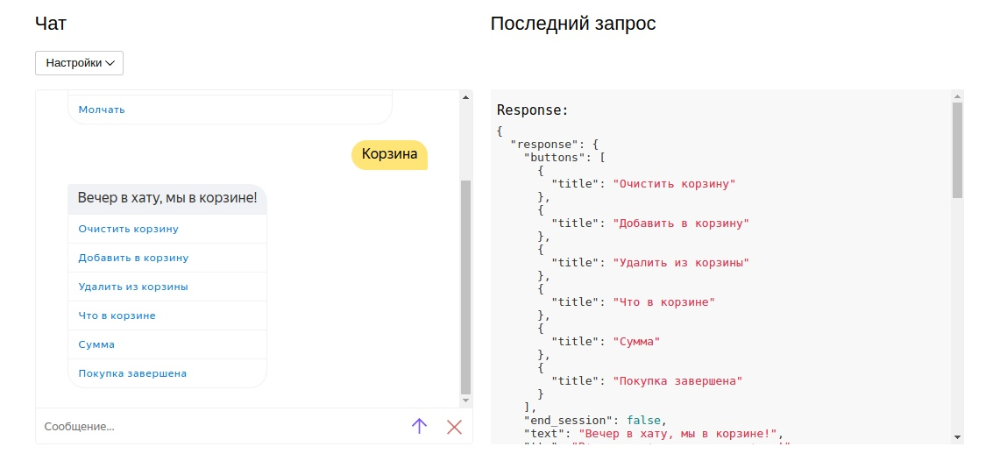<br>
Рис. 3. Вход в корзину
</p>
<p align="center">
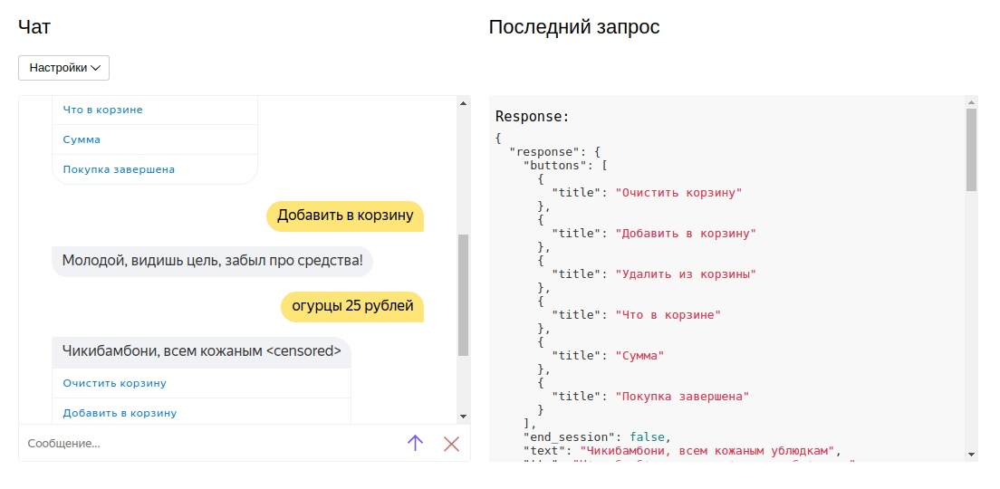<br>
Рис. 4. Добавление в корзину
</p>
<p align="center">
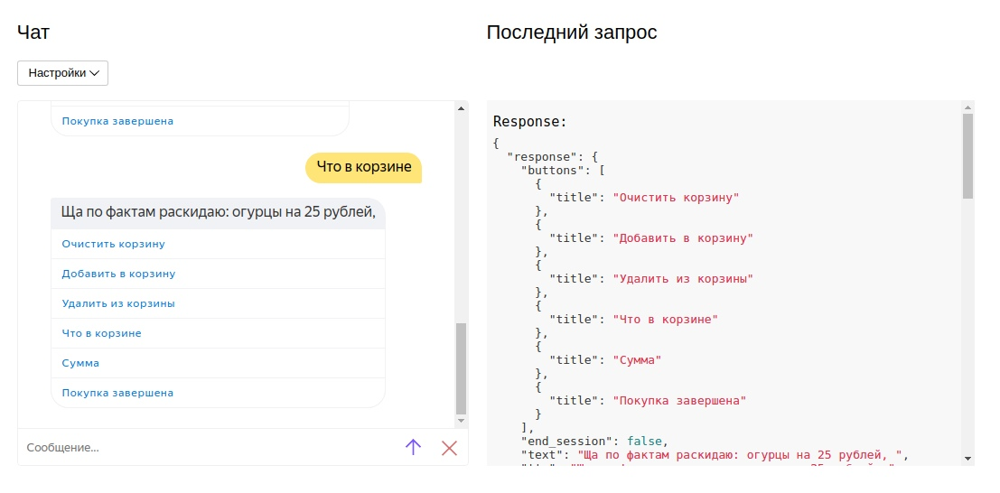<br>
Рис. 5. Что в корзине
</p>
<p align="center">
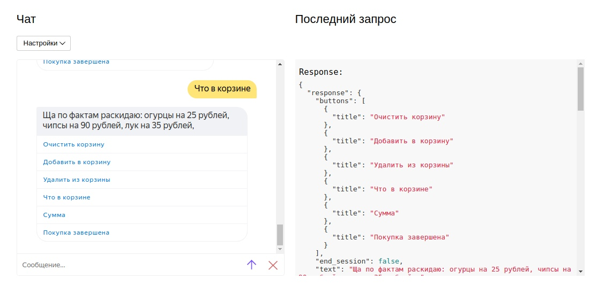<br>
Рис. 6. Удаление товара, начальное состояние корзины
</p>
<p align="center">
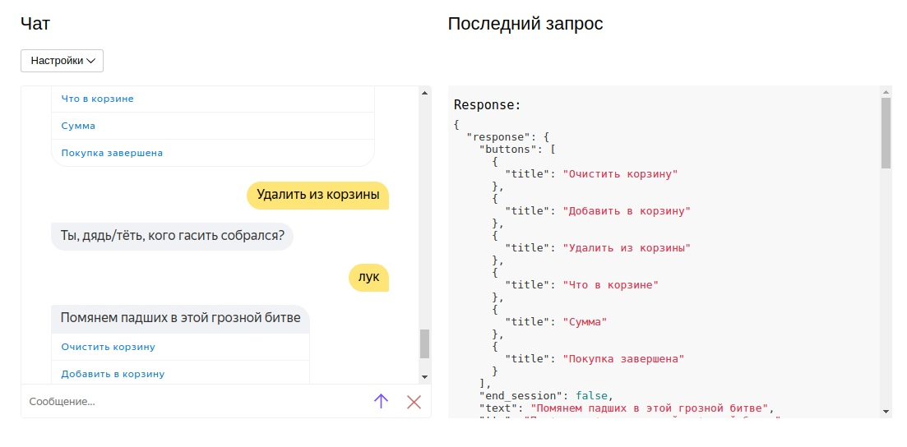<br>
Рис. 7. Удаление товара, команда
</p>
<p align="center">
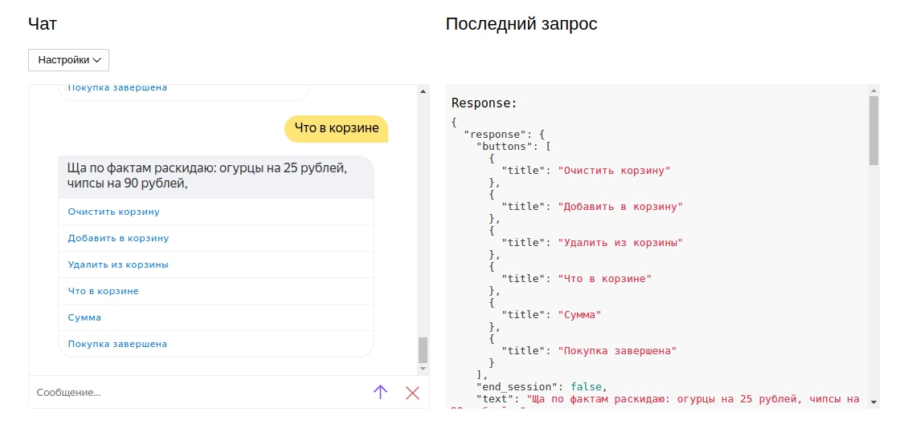<br>
Рис. 8. Удаление товара, конечное состояние корзины
</p>
<p align="center">
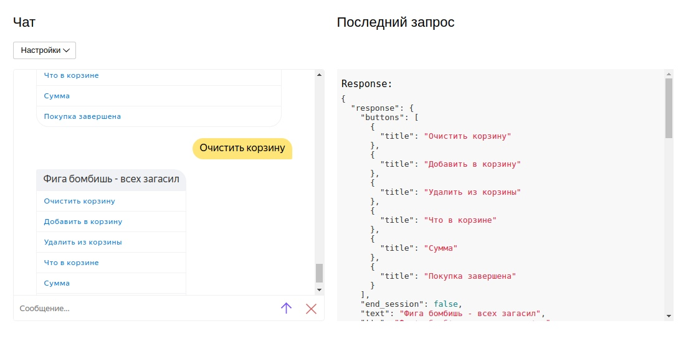<br>
Рис. 9. Очищение корзины
</p>
<p align="center">
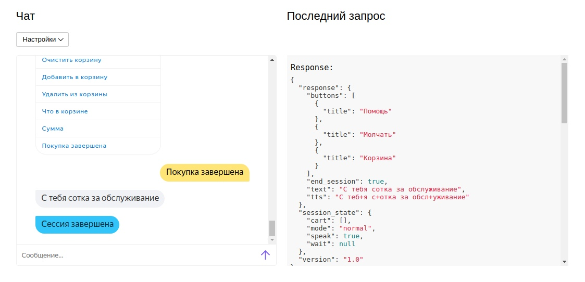<br>
Рис. 10. Завершение покупки
</p>

После завершение сессии этот роут отправляет изменения post-запросом на питоновский сервер, который сохраняет чек в [excel файл](./Python/data.xlsx).

</details>

<details><summary>Функционал "Помощь"</summary>

Помощь принимает все команды. Если была запрос `назад`, то происходит выход в главное меню. В любом другом случае осуществляется поиск по файлу диалога [help/all.json](./C++/json/dialog/help/all.json). В настоящий момент имеется справка только для самой корзины, но при желании справку можно дописать в JSON файлах.

<p align="center">
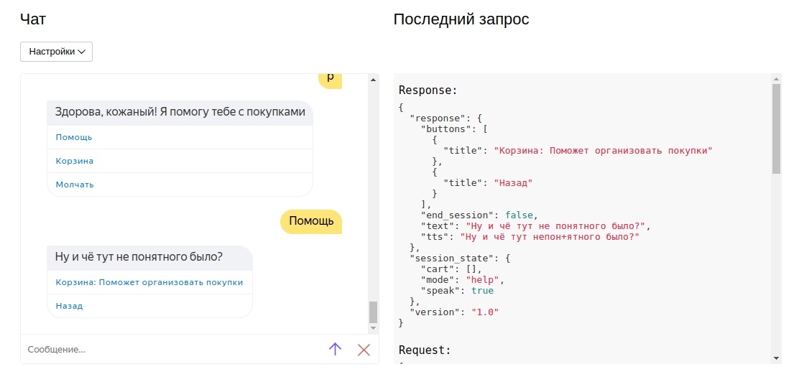<br>
Рис. 11. Режим справки
</p>
<p align="center">
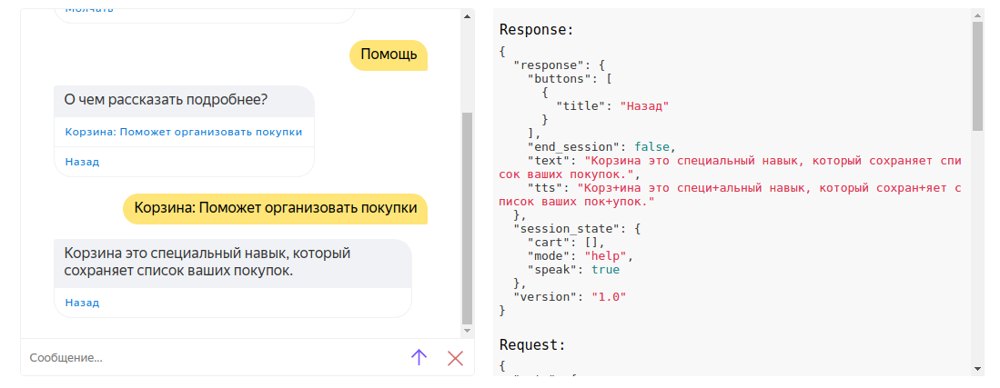<br>
Рис. 12. Справка по корзине
</p>

</details>

### Питоновский клиент

[Клиент на питоне](./Python/main.py) обрабатывает поступающие пост запросы. Он содержит переменную буфер. Когда её размер превосходит предустановленную константу `BUFFER_SIZE`, происходит сохранение чеков в файл [data.xlsx](./Python/data.xlsx).

<details><summary>Исходный код</summary>

```python
from flask import Flask
from flask.globals import request
import openpyxl
import os.path
import datetime


app = Flask(__name__)

pwd = os.path.abspath(os.path.dirname(__file__))

#BUFFER_SIZE = 1000
BUFFER_SIZE = 0
buffer = []


@app.route('/', methods=['POST', 'GET'])
def index():
   global buffer
   
   if request.method == 'POST':
      
      buffer += [request.json]
      print('req.body:', buffer[-1])
      if (len(buffer) > BUFFER_SIZE):
         save_excel()
         buffer = []
         
      return 'OK'
      
   elif request.method == 'GET':
      return 'Это GET запрос'


def save_excel():
   global buffer
   
   STORAGE_FILE = os.path.join(pwd, 'data.xlsx')
   
   book = None
   # create or open book
   if not os.path.exists(STORAGE_FILE):
      book = openpyxl.Workbook()
      # headers
      book.active['A1'] = 'N'
      book.active['B1'] = 'User ID'
      book.active['C1'] = 'Datetime'
      book.active['D1'] = 'Item'
      book.active['E1'] = 'Prise'
      book.save(STORAGE_FILE)
   else:
      book = openpyxl.open(STORAGE_FILE)   
   sheet = book.active
   
   max_row = len(sheet['A'])
   nowtime = datetime.datetime.utcnow()
   
   row = max_row + 1
   for dataset in buffer:
      id = dataset['user_id']
      check = dataset['check']
      
      for item in check:
         sheet[row][0].value = row - 1
         sheet[row][1].value = id
         sheet[row][2].value = nowtime
         sheet[row][3].value = item['name']
         sheet[row][4].value = item['price']
         row += 1
   
   book.save(STORAGE_FILE)
   book.close()

if __name__ == '__main__':
   app.run()
```

</details>

## Вывод
Все поставленные задачи выполнены, а цель работы достигнута - разработано распределённое клиент-серверное приложение, использующее возможности Yandex.Dialogs для обработки запросов пользователя. Благодаря этому реализовано приложение, выполняющее составление списка продуктов и подсчет суммарной стоимости чека.

В разработке С++-сервера использованы две сторонние библиотеки: `json` и `cpp-httplib`. Python-клиент использует библиотеку `flask` обработки post-запросов.

Практика показывает, что любое приложение рано или поздно требует хранения информации на серверах, поэтому умение разрабатывать клиент-серверные приложения является важным навыком в современном мире программирования. Также, повышается популярность использования голосовых помощников и умение разрабатывать такие приложения является важным навыком.

Директории:
[[C++]](./C++) [[Python]](./Python)