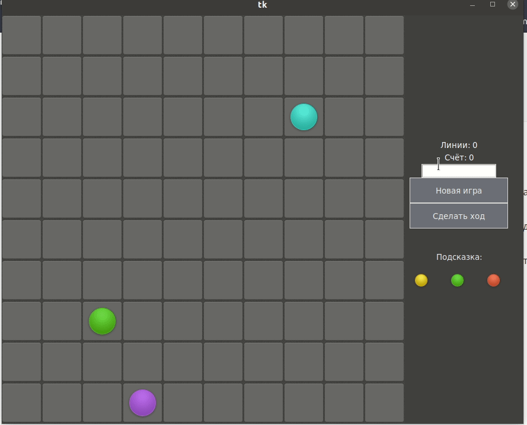

<p align="center">МИНИСТЕРСТВО НАУКИ  И ВЫСШЕГО ОБРАЗОВАНИЯ РОССИЙСКОЙ ФЕДЕРАЦИИ<br>
Федеральное государственное автономное образовательное учреждение высшего образования<br>
"КРЫМСКИЙ ФЕДЕРАЛЬНЫЙ УНИВЕРСИТЕТ им. В. И. ВЕРНАДСКОГО"<br>
ФИЗИКО-ТЕХНИЧЕСКИЙ ИНСТИТУТ<br>
Кафедра компьютерной инженерии и моделирования</p>
<br>
<h3 align="center">Отчёт по лабораторной работе № 3<br> по дисциплине "Программирование"</h3>
<br><br>
<p>студента 1 курса группы ПИ-б-о-201(2)<br>
Никонова Федора Андреевича<br>
направления подготовки 09.03.04 "Программная инженерия"</p>
<br><br>
<table>
<tr><td>Научный руководитель<br> старший преподаватель кафедры<br> компьютерной инженерии и моделирования</td>
<td>(оценка)</td>
<td>Чабанов В.В.</td>
</tr>
</table>
<br><br>
<p align="center">Симферополь, 2020</p>
<hr>

## Постановка задачи

Используя стандартный модуль для разработки программ с графическим интерфейсом Tkinter реализуйте игру Lines на зыке Python.
В качестве образца графического интерфейса используйте [данную игру](http://game-shariki.ru/linii-2).
## Цель работы
Научится создавать графические приложения с использованием библиотеки `TKinter`, а также погрузится в разработку игровой логики с использованием ООП методологии.

Директории:
[[C++]](./C++) [[Python]](./Python)

### Информация о проекте

Версия Python: `python3.9`
<br>
ОС: `Ubuntu 20.04.01 LTS`

## Выполнение работы

Первым шагом для разработки стало составление блок-схемы логики приложения, которая доступна по [этой ссылке](http://frity.ru/drawio-link.html). Далее производилась программная реализация приложения. Весь код был разделён по паттерну MVC - [Model View Controller](https://ru.wikipedia.org/wiki/Model-View-Controller), однако он был немного изменён. Controller и Model являются одним целым. Это позволительно, поскольку проект относительно небольшой.

Входной точкой в проект является файл [main.py](./Python/main.py), который импортирует файлы [view.py](./Python/modules/view.py) и [model.py](./Python/modules/model.py).

<details><summary>Исходный код</summary>

```py
from modules.view import View
from modules.model import Model

view = View(10) # create view - 10 is field size
model = Model(view) # add logic

view.render()
```

</details><br>

Далее был разработан внешний вид приложения. В геймдеве максимально применимо ООП, поэтому для каждого объекта интерфейса был создан свой класс, которые объединены основным - View.

<details><summary>Исходный код</summary>

```py
from tkinter import *
from PIL import Image, ImageTk
from os import path


class Pos:
   def __init__(self, x: int, y: int):
      self.x = x
      self.y = y
      
   @staticmethod
   def differ(pos1, pos2):
      return Pos(pos1.x-pos2.x, pos1.y-pos2.y)


class Tile:
   def __init__(self, name, size):
      img_folder = path.realpath(path.dirname(__file__) + '/../img')
      self._image_path = img_folder + f'/{name}.png'
      self.normal
      self.size = size
      
      self.taken = [None for i in range(10)]
      
   @property
   def rgba(self):
      self.image = Image.open(self._image_path).convert('RGBA')
      return self
   @property
   def normal(self):
      self.image = Image.open(self._image_path)
      return self
   
   def take(self, i):
      if not self.taken[i]:
         taken = self.cut(i)
         taken_photo = ImageTk.PhotoImage(taken)
         self.taken[i] = taken_photo
         return taken_photo

      else:
         return self.taken[i]
      
   def cut(self, i):
      step = self.size
      xs = 1; xe = self.size
      ys = (i-1) * step; ye = i * step
      taken = self.image.crop((xs, ys, xe, ye))
      
      return taken
      
       

class ViewTiles():
   def __init__(self):
      self.ball_aqua = Tile('ball-aqua', 60)
      self.ball_blue = Tile('ball-blue', 60)
      self.ball_green = Tile('ball-green', 60)
      self.ball_pink = Tile('ball-pink', 60)
      self.ball_red = Tile('ball-red', 60)
      self.ball_violet = Tile('ball-violet', 60)
      self.ball_yellow = Tile('ball-yellow', 60)
      
      self.cell = Tile('cell-bgr', 69)
      self.page = Tile('page-bgr', 128)
            
tiles = None


class ViewCell(Label):
   def __init__(self, master, row, col, field):
      self.baked = None
      self.ball_tile = None
      self.field: list[list[ViewCell]] = field
      
      super().__init__(master, image=tiles.cell.take(1), borderwidth=0)
      self.grid(row=row, column=col)
      self.bind('<Button-1>', self.on_click)
      self.on_click_handler = None
      self.pos = Pos(col, row)
      self.is_prev = False # for waterfall algor
      
      
   def put_ball(self, ball_tile: Tile):
      self._blend_bg_ball(1, ball_tile, 1)
      
   def select_ball(self):
      self._blend_bg_ball(2, self.ball_tile, 1)
      
   def unselect_ball(self):
      self._blend_bg_ball(1, self.ball_tile, 1)
   
   def _blend_bg_ball(self, bg_tile_num, ball_tile, ball_tile_num):
      bg = tiles.cell.rgba.cut(bg_tile_num)
      ball = ball_tile.rgba.cut(ball_tile_num)
      ball_new = Image.new('RGBA', bg.size)
      ball_new.paste(ball, (7, 6))
      baked = Image.alpha_composite(bg, ball_new)
      baked_photo = ImageTk.PhotoImage(baked)
      self.baked = baked_photo
      self.ball_tile = ball_tile
      self.config(image=baked_photo)
      
      
   def clear(self):
      self.baked = None
      self.config(image=tiles.cell.take(1))
      
   def on_click(self, event):
      if (self.on_click_handler):
         self.on_click_handler(self, event)
         
   @property
   def is_free(self):
      return not self.baked
   
   def sibling_in(self, direction: Pos):
      rev_dir = Pos(-direction.x, -direction.y)
      new_pos = Pos.differ(self.pos, rev_dir)
      if (new_pos.x < 0 or new_pos.y < 0 or 
          new_pos.y > len(self.field)-1 or new_pos.x > len(self.field[0])-1):
         return None
      return self.field[new_pos.y][new_pos.x]


class ViewAsideInfo():
   def __init__(self, master):
      self.lines = Label(master, bg='#414141', fg='#ffffff')
      self.lines.grid(row=1, column=1, columnspan=3)
      self.score = Label(master, bg='#414141', fg='#ffffff')
      self.score.grid(row=2, column=1, columnspan=3)
      self.debug = Text(master, height=1, width=15)
      self.debug.grid(row=3, column=1, columnspan=3)
      self.update_lines(0)
      self.update_score(0)
      
   def update_lines(self, value):
      self.lines.config(text=f'Линии: {value}')
      
   def update_score(self, value):
      self.score.config(text=f'Счёт: {value}')
      
   def get_debug(self):
      return self.debug.get('1.0', END).strip()

class ViewAsideControls():
   def __init__(self, master):
      Label(master, height=1, background='#414141').grid(row=3, column=1, columnspan=3)
      
      self.new_game = Button(master, text="Новая игра", bg='#6e7078', fg='#eeeeee', padx=20, pady=10, relief='flat', width=15)
      self.new_game.grid(row=5, column=1, columnspan=3)
      self.step = Button(master, text="Сделать ход", bg='#6e7078', fg='#eeeeee', padx=20, pady=10, relief='flat', width=15)
      self.step.grid(row=6, column=1, columnspan=3)
      
class ViewAsideHint(list):
   def __init__(self, master):
      super().__init__()
      Label(master, height=2, background='#414141').grid(row=7, column=1, columnspan=3)
      Label(master, text='Подсказка:', bg='#414141', fg='#eeeeee').grid(row=8, column=1, columnspan=3)
      self.model = []
      for i in range(3):
         self.append(Label(master, bg='#414141'))
         self.model.append(None)
         self[i].grid(row=9, column=1+i)
         
   def update(self: list, three_balls: list):
      i = 0
      for ball in three_balls:
         self[i].config(image=ball.take(5))
         self.model[i] = ball
         i += 1

class ViewAside():
   def __init__(self, master):
      master.config(bg='#414141')
      self.controls = ViewAsideControls(master)
      self.hint = ViewAsideHint(master)
      self.info = ViewAsideInfo(master)

class View():
   def __init__(self, N):
      global tiles
      
      self.root = Tk()
      aside_width = 200
      width = 68 * N + aside_width
      height = 68 * N + 10
      self.size = Pos(width, height)
      self.root.geometry(f'{width}x{height}')
      self.N = N
      
      tiles = ViewTiles()
      self.tiles = tiles
      
      self.root.config(background='#414141')
      
      self.field_frame = Frame(self.root)
      self.field_frame.grid(row=1, column=1)
      
      self.aside_frame = Frame(self.root, width=aside_width)
      self.aside_frame.grid(row=1, column=2)
      self.aside = ViewAside(self.aside_frame)
      
      self.field = []
      for row in range(N):
         self.field.append([])
         for col in range(N):
            cell = ViewCell(self.field_frame, row, col, self.field)
            self.field[row].append(cell)
            
      self.game_over = Label(self.field_frame, text="Игра окочена", fg='white', bg='#414141', font=('sans-serif', 30, 'bold'))
      
      
   @property
   def game_over_visibility(self):
      pass
      
   @game_over_visibility.setter
   def game_over_visibility(self, visible: bool):
      if visible:
         self.game_over.place(x=self.size.x/4.8, y=self.size.y/2.2)
      else:
         self.game_over.place_forget()
            
      
   def render(self):
      self.root.mainloop()
```

</details><br>

Далее была разработана игровая логика согласно диаграмме, представленной в начале. Результатом стал класс Model.

<details><summary>Исходный код</summary>

```py
from tkinter import *
from PIL import Image, ImageTk
from os import path


class Pos:
   def __init__(self, x: int, y: int):
      self.x = x
      self.y = y
      
   @staticmethod
   def differ(pos1, pos2):
      return Pos(pos1.x-pos2.x, pos1.y-pos2.y)


class Tile:
   def __init__(self, name, size):
      img_folder = path.realpath(path.dirname(__file__) + '/../img')
      self._image_path = img_folder + f'/{name}.png'
      self.normal
      self.size = size
      
      self.taken = [None for i in range(10)]
      
   @property
   def rgba(self):
      self.image = Image.open(self._image_path).convert('RGBA')
      return self
   @property
   def normal(self):
      self.image = Image.open(self._image_path)
      return self
   
   def take(self, i):
      if not self.taken[i]:
         taken = self.cut(i)
         taken_photo = ImageTk.PhotoImage(taken)
         self.taken[i] = taken_photo
         return taken_photo

      else:
         return self.taken[i]
      
   def cut(self, i):
      step = self.size
      xs = 1; xe = self.size
      ys = (i-1) * step; ye = i * step
      taken = self.image.crop((xs, ys, xe, ye))
      
      return taken
      
       

class ViewTiles():
   def __init__(self):
      self.ball_aqua = Tile('ball-aqua', 60)
      self.ball_blue = Tile('ball-blue', 60)
      self.ball_green = Tile('ball-green', 60)
      self.ball_pink = Tile('ball-pink', 60)
      self.ball_red = Tile('ball-red', 60)
      self.ball_violet = Tile('ball-violet', 60)
      self.ball_yellow = Tile('ball-yellow', 60)
      
      self.cell = Tile('cell-bgr', 69)
      self.page = Tile('page-bgr', 128)
            
tiles = None


class ViewCell(Label):
   def __init__(self, master, row, col, field):
      self.baked = None
      self.ball_tile = None
      self.field: list[list[ViewCell]] = field
      
      super().__init__(master, image=tiles.cell.take(1), borderwidth=0)
      self.grid(row=row, column=col)
      self.bind('<Button-1>', self.on_click)
      self.on_click_handler = None
      self.pos = Pos(col, row)
      self.is_prev = False # for waterfall algor
      
      
   def put_ball(self, ball_tile: Tile):
      self._blend_bg_ball(1, ball_tile, 1)
      
   def select_ball(self):
      self._blend_bg_ball(2, self.ball_tile, 1)
      
   def unselect_ball(self):
      self._blend_bg_ball(1, self.ball_tile, 1)
   
   def _blend_bg_ball(self, bg_tile_num, ball_tile, ball_tile_num):
      bg = tiles.cell.rgba.cut(bg_tile_num)
      ball = ball_tile.rgba.cut(ball_tile_num)
      ball_new = Image.new('RGBA', bg.size)
      ball_new.paste(ball, (7, 6))
      baked = Image.alpha_composite(bg, ball_new)
      baked_photo = ImageTk.PhotoImage(baked)
      self.baked = baked_photo
      self.ball_tile = ball_tile
      self.config(image=baked_photo)
      
      
   def clear(self):
      self.baked = None
      self.config(image=tiles.cell.take(1))
      
   def on_click(self, event):
      if (self.on_click_handler):
         self.on_click_handler(self, event)
         
   @property
   def is_free(self):
      return not self.baked
   
   def sibling_in(self, direction: Pos):
      rev_dir = Pos(-direction.x, -direction.y)
      new_pos = Pos.differ(self.pos, rev_dir)
      if (new_pos.x < 0 or new_pos.y < 0 or 
          new_pos.y > len(self.field)-1 or new_pos.x > len(self.field[0])-1):
         return None
      return self.field[new_pos.y][new_pos.x]


class ViewAsideInfo():
   def __init__(self, master):
      self.lines = Label(master, bg='#414141', fg='#ffffff')
      self.lines.grid(row=1, column=1, columnspan=3)
      self.score = Label(master, bg='#414141', fg='#ffffff')
      self.score.grid(row=2, column=1, columnspan=3)
      self.debug = Text(master, height=1, width=15)
      self.debug.grid(row=3, column=1, columnspan=3)
      self.update_lines(0)
      self.update_score(0)
      
   def update_lines(self, value):
      self.lines.config(text=f'Линии: {value}')
      
   def update_score(self, value):
      self.score.config(text=f'Счёт: {value}')
      
   def get_debug(self):
      return self.debug.get('1.0', END).strip()

class ViewAsideControls():
   def __init__(self, master):
      Label(master, height=1, background='#414141').grid(row=3, column=1, columnspan=3)
      
      self.new_game = Button(master, text="Новая игра", bg='#6e7078', fg='#eeeeee', padx=20, pady=10, relief='flat', width=15)
      self.new_game.grid(row=5, column=1, columnspan=3)
      self.step = Button(master, text="Сделать ход", bg='#6e7078', fg='#eeeeee', padx=20, pady=10, relief='flat', width=15)
      self.step.grid(row=6, column=1, columnspan=3)
      
class ViewAsideHint(list):
   def __init__(self, master):
      super().__init__()
      Label(master, height=2, background='#414141').grid(row=7, column=1, columnspan=3)
      Label(master, text='Подсказка:', bg='#414141', fg='#eeeeee').grid(row=8, column=1, columnspan=3)
      self.model = []
      for i in range(3):
         self.append(Label(master, bg='#414141'))
         self.model.append(None)
         self[i].grid(row=9, column=1+i)
         
   def update(self: list, three_balls: list):
      i = 0
      for ball in three_balls:
         self[i].config(image=ball.take(5))
         self.model[i] = ball
         i += 1

class ViewAside():
   def __init__(self, master):
      master.config(bg='#414141')
      self.controls = ViewAsideControls(master)
      self.hint = ViewAsideHint(master)
      self.info = ViewAsideInfo(master)

class View():
   def __init__(self, N):
      global tiles
      
      self.root = Tk()
      aside_width = 200
      width = 68 * N + aside_width
      height = 68 * N + 10
      self.size = Pos(width, height)
      self.root.geometry(f'{width}x{height}')
      self.N = N
      
      tiles = ViewTiles()
      self.tiles = tiles
      
      self.root.config(background='#414141')
      
      self.field_frame = Frame(self.root)
      self.field_frame.grid(row=1, column=1)
      
      self.aside_frame = Frame(self.root, width=aside_width)
      self.aside_frame.grid(row=1, column=2)
      self.aside = ViewAside(self.aside_frame)
      
      self.field = []
      for row in range(N):
         self.field.append([])
         for col in range(N):
            cell = ViewCell(self.field_frame, row, col, self.field)
            self.field[row].append(cell)
            
      self.game_over = Label(self.field_frame, text="Игра окочена", fg='white', bg='#414141', font=('sans-serif', 30, 'bold'))
      
      
   @property
   def game_over_visibility(self):
      pass
      
   @game_over_visibility.setter
   def game_over_visibility(self, visible: bool):
      if visible:
         self.game_over.place(x=self.size.x/4.8, y=self.size.y/2.2)
      else:
         self.game_over.place_forget()
            
      
   def render(self):
      self.root.mainloop()
```

</details><br>

Класс Model использует класс View и "оживляет" его, добавляя требуемый функционал.

***Результат работы игры продемонстрирован ниже.*** В качестве дополнительной возможности был добавлен режим бога, который убирает добавление шариков после перемещения.

<p align="center">
<br>
Рис. 1. Геймплей и возможности
</p>

## Вывод
Все поставленные задачи выполнены, а цель работы достигнута - разработана Lines, с использованием графической библиотеки TKinter. Благодаря этому реализовано приложение, реализующее предполагаему игровую логику.

В разработке использована одна сторонняя библиотека, не считая TKinter: `Pillow` или `PIL`. Она отвечает за работу с изображениями в TKinter.

Директории:
[[C++]](./C++) [[Python]](./Python)