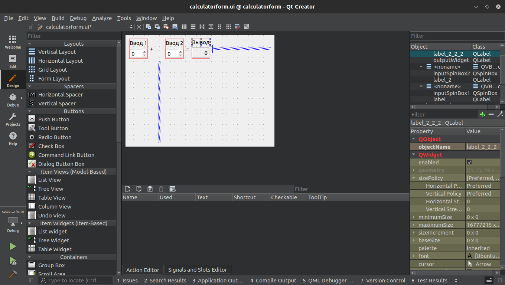
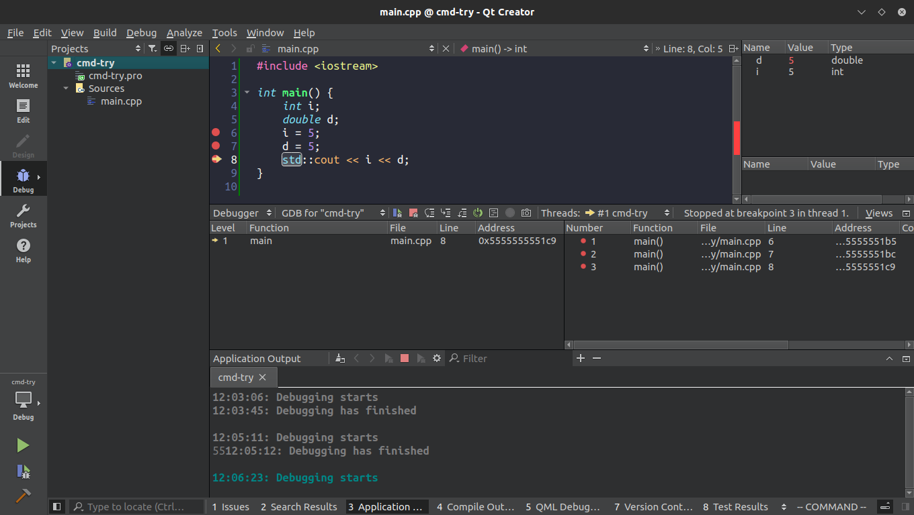

МИНИСТЕРСТВО НАУКИ  И ВЫСШЕГО ОБРАЗОВАНИЯ РОССИЙСКОЙ ФЕДЕРАЦИИ 
Федеральное государственное автономное образовательное учреждение высшего образования 
"КРЫМСКИЙ ФЕДЕРАЛЬНЫЙ УНИВЕРСИТЕТ им. В. И. ВЕРНАДСКОГО" 
ФИЗИКО-ТЕХНИЧЕСКИЙ ИНСТИТУТ 
Кафедра компьютерной инженерии и моделирования

 
<h3 align="center">Отчёт по лабораторной работе № 4  по дисциплине "Программирование"</h3>
  

студента 1 курса группы ПИ-б-о-201(2) 
Никонова Федора Андреевича 
направления подготовки 09.03.04 "Программная инженерия"

  
<table>
<tr><td>Научный руководитель  старший преподаватель кафедры  компьютерной инженерии и моделирования</td>
<td>(оценка)</td>
<td>Чабанов В.В.</td>
</tr>
</table>
  

Симферополь, 2020

## Постановка задачи

Настроить рабочее окружение, для разработки программного обеспечения при помощи Qt и IDE Qt Creator, а также изучить базовые возможности данного фреймворка.

## Выполнение работы

### Задание 1

Сперва была произведена регистрация на сайте Qt, затем установка Qt Creator Community. Используемая операционная система Ubuntu 20.04 LTS. Дальнейшие действия шли согласно предоставленным заданиям.

 
Рис. 1. Дизайнер Qt Creator

### Задание 2

| Вопрос | Ответ |
| ------ | ----- |
| Как изменить цветовую схему (оформление) среды? | Tools > Options > Environment > Interface > Theme |
| Как закомментировать/раскомментировать блок кода средствами Qt Creator? Имеется ввиду комбинация клавиш или пункт меню. | `Edit > Advanced > Toggle Comment` _OR_ `Ctrl+/` |
| Как открыть в проводнике Windows папку с проектом средствами Qt Creator? | В режиме редактирования нажимаем ПКМ по любой папке > Show containing folder |
| Какое расширение файла-проекта используется Qt Creator? Может быть несколько ответов. | pro |
| Как запустить код без отладки? | `Ctrl+r` |
| Как запустить код в режиме отладки? | `F5` |
| Как установить/убрать точку останова (breakpoint)? | Клик левее номера строки |

### Задание 3

 
Рис. 2. Отладка в Qt Creator

| Вопрос | Ответ |
| ------ | ----- |
| Чему равны переменные i и d в 6 строке (тут и далее, нужно написать значения) | `i = 32767; d = 0;` |
| Чему равны переменные i и d в 7 строке | `i = 5; d = 0;` |
| Чему равны переменные i и d в 8 строке | `i = 5; d = 5;` |

## Вывод

В ходе работы была изучена кроссплатформенная среда разработки Qt Creator. Также была произведена первоначальная настройка рабочего окружения, изучен проект калькулятора, поставляемый вместе со средой, а также создано тестовое консольное приложение с целью изучения процесса отладки, который в последствии был изучен.